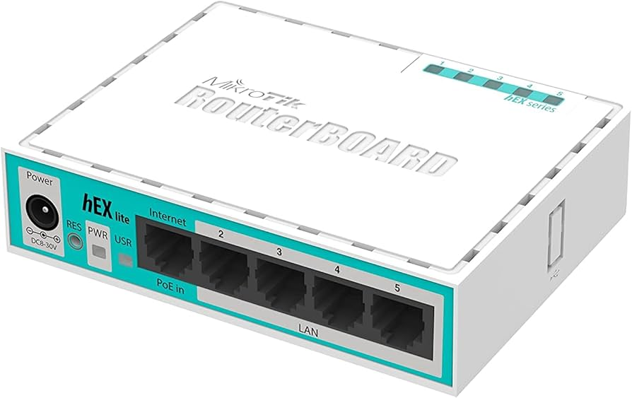

# Basic MikroTik Router Configuration

> This guide outlines the essential steps to configure a Mikrotik RouterBoard from scratch to provide internet access to a local network using the **Winbox** management tool.

<div align="center"><figure><figcaption></figcaption></figure></div>

## MikroTik Configuration using Graphical Interface&#x20;

### I. Prerequisites and Preparation

* **Management Tool:** [Download](https://mikrotik.com/download/winbox) and use **Winbox** (better use Legacy version), a specific tool developed by Mikrotik for device management.\
  \
  
* **Network Planning:** Before starting, define your network topology, including the provider's IP, the WAN port, and the intended LAN IP range.
* ~~**Initial PC Configuration:** To access the router initially, manually set a fixed IP on your computer within the intended LAN range (e.g., IP: `192.168.69.30`, Mask: `255.255.255.0`, Gateway: `192.168.69.254`). Set DNS servers to `8.8.8.8` and `1.1.1.1`.~~
* **Connecting to the Device:** Open Winbox, click "Refresh," and select the router's MAC address. The default login is **admin** with **no password**.\
  \
  .png>)
*   **Resetting to Factory Defaults:** To ensure a clean setup, open a "New Terminal" and execute: `system reset-configuration no-defaults=yes`.<br>

    <div align="left"><figure><figcaption></figcaption></figure> <figure><figcaption></figcaption></figure></div>

***

### II. The Five Key Configuration Steps



**Identification of Device and Interfaces**

* **Identity:** Assign a name to the router via `System -> Identity` to easily recognize it on the network.\
  .png>)
* **Interfaces:** Label the physical ports for clarity in `Interfaces`. For example, set **Ether1** as "WAN" (internet input) and **Ether2** as "LAN" (local network output); .\
  



**Assigning IP Addresses**

* Navigate to `IP -> Addresses`.\
  
* **WAN IP:** Providing there is a DHCP Server on the Network, the IP Address is assifned automatically. Otherwise, assign the IP address provided by your ISP to the WAN interface (e.g., `192.168.69.201/24`).&#x20;
* **LAN IP:** Assign the gateway IP for your local network to the LAN interface (e.g., `192.168.10.1/24`).


Bear in mind that it is mandatory to add the CIDR notation in the Address as `192.168.10.1/24` . The red arrow shows the missing `/24` notation.&#x20;




**Configuring NAT (Masquerade)**

* This allows multiple devices on the LAN to share a single internet connection.
* Go to `IP -> Firewall -> NAT` and add a new rule.

<div><figure><figcaption></figcaption></figure> <figure><figcaption></figcaption></figure></div>

* Set **Chain** to `srcnat` and **Out. Interface** to your WAN port.
* Under the **Action** tab, select **masquerade**.



**DNS Configuration**

* Enter the primary DNS (`8.8.8.8`) and secondary DNS (`1.1.1.1`).
* **Crucial:** Check the box **"Allow Remote Requests"** so the router can resolve DNS queries for the connected clients.



**Static Default Route (CISCO related&#x20;**_**Next Hop**_**)**

* This tells the router where to send traffic destined for the internet.
* Go to `IP -> Routes` and add a new route.
* In the **Gateway** field, enter the IP address of the provider's modem/router (e.g., `192.168.69.254`) and **Dst. Address** `0.0.0.0/0`.



**DHCP Server Setup**

* This creates a pool of addresses and a DHCP server PCs get IPs automatically.
* Go to `IP -> DHCP Server` and push button DHCP Setup ath the right. You will do it easily clicking next button and checking if the defaults are right to your setup. \
  
* Assign the DHCP server to the LAN interface (Ether1, Ether2, Ether3) you need the addresses to be automatically distributed.&#x20;
* Choose the network address you want to be distributed.&#x20;
* Choose an IP to the server's interface (either the first or the last of the range).
* Choose the IPs range.
* Choose the DNS Servers.&#x20;
* Choose the lease time.&#x20;

<div><figure><figcaption></figcaption></figure> <figure><figcaption></figcaption></figure> <figure><figcaption></figcaption></figure> <figure><figcaption></figcaption></figure> <figure><figcaption></figcaption></figure></div>



***


Which device should you use to connect two subnets? Either a Switch or a Router? Justify your answer. \
i.e. Given Network Address `192.168.10.0/24` splitted into `192.168.10.0/25` and `192.168.10.128/25`.&#x20;


***

**III. Verification**

* Open a terminal within Winbox and attempt to **ping** a public IP address (e.g., `ping www.uni.eus`).
* If the route is correctly configured, you will receive replies. Deleting the default route will immediately result in a loss of internet access.

<details>

<summary>MikroTik Connectivity Troubleshooting Checklist</summary>

If you cannot reach the Internet or ping your gateway, follow these steps in order. Do not skip steps.

**Step 1: Physical Layer & Interface Status**

* Check the "R" flag: In Winbox, go to `Interfaces`. Does your WAN (`ether1`) and LAN (`ether2`) have an "R" (Running) next to them?
  * _No "R"?_ Check the cable or the device at the other end.
* Check for "X": Is the interface disabled? Right-click and Enable if you see an "X".

**Step 2: Layer 3 (IP Addressing)**

* Router IP: Run `/ip address print`. Do you have the correct IP and subnet mask (e.g., `/24`) on the correct interface?
* PC IP: On your computer, run `ipconfig` (Windows) or `ip addr` (Linux).
  * Did you get an IP in the `192.168.10.x` range?
  * Is the Default Gateway `192.168.10.1`?

**Step 3: Gateway & Routing**

* Default Route: Run `/ip route print`.
  * Do you see a route to `0.0.0.0/0` with the gateway `192.168.69.254`?
  * It must have the flags AS (Active Static).
* Router Ping: From the MikroTik Terminal, run `ping 192.168.69.254`.
  * _If this fails,_ the problem is between your MikroTik and the upstream router.

**Step 4: NAT (Masquerade)**

* The Rule: Run `/ip firewall nat print`.
  * Is there a rule with `chain=srcnat`, `out-interface=ether1` (or WAN list), and `action=masquerade`?
* Traffic Counters: Look at the `packets` column. If you ping `8.8.8.8` from your PC and the counter does not increase, your NAT rule is configured incorrectly.

**Step 5: DNS (Domain Name System)**

* The "Ping 8" Test: From your PC, run `ping 8.8.8.8`.
  * _Works?_ Your connection is fine.
  * _Fails?_ Your NAT or Routing is broken.
* The "Ping Google" Test: From your PC, run `ping www.google.com`.
  * _Fails?_ Your DNS is broken.
  * _Fix:_ Check `/ip dns print` and ensure "Allow Remote Requests" is checked.

**Step 6: Firewall Filter Rules**

* The "Rule 0" Trap: If you have a `drop` rule at the very top of your list (index 0), it might be blocking everything.
* Temporary Disable: Select all firewall rules in Winbox and click the "X" (Disable). If the internet starts working, one of your rules is too restrictive.

***

#### Summary of Common Fixes

| Problem                                                              | Most Likely Cause               | CLI Fix Command                                                            |
| -------------------------------------------------------------------- | ------------------------------- | -------------------------------------------------------------------------- |
| PC gets no IP                                                        | DHCP Server on wrong interface  | `/ip dhcp-server set [find] interface=ether2`                              |
| Router pings 8.8.8.8, PC does not                                    | Missing NAT Masquerade          | `/ip firewall nat add chain=srcnat action=masquerade out-interface=ether1` |
| Can ping 8.8.8.8, but not https://www.google.com/search?q=google.com | DNS "Allow Remote Requests" off | `/ip dns set allow-remote-requests=yes`                                    |
| Everything looks right, but no ping                                  | Windows Firewall is ON          | _Disable Windows Firewall on the PC_                                       |

</details>


&#x20;Configuring a router is like setting up a **International Post Office:**

1. **Identification** is naming the building and labeling the "Inbound" and "Outbound" doors.
2. **IP Addressing** is giving the building an official address.
3. **NAT (Masquerade)** acts like a group passport, allowing all employees (LAN devices) to travel abroad using the office's single ID.
4. **DNS** is the phonebook.
5. **The Default Route** is the map that shows exactly which highway leads out of town to the rest of the world.




<details>

<summary>(OPTIONAL) MikroTik Configuration using CLI (Command Line Interface) on the Route</summary>

### 1. Initial Configuration (Setting up the Router)

These commands will set up the basic routing, addressing, and NAT required for internet access.

#### A. IP Addressing

Assign static IP addresses to the WAN (Internet) and LAN (Local) interfaces.

```bash
# Set the WAN IP (to the upstream router)
/ip address add address=192.168.69.201/24 interface=ether1

# Set the LAN Gateway IP (for the students' network)
/ip address add address=192.168.10.1/24 interface=ether2
```

#### B. Default Route (The Gateway)

Tell the router where to send traffic destined for the internet.

```bash
/ip route add gateway=192.168.69.254
```

#### C. DNS Configuration

Enable the router to resolve domain names and act as a DNS cache for clients.

```bash
/ip dns set servers=8.8.8.8,1.1.1.1 allow-remote-requests=yes
```

#### D. DHCP Server Setup

Create a pool of addresses and a DHCP server so students' PCs get IPs automatically.

```bash
# 1. Define the range of available IPs
/ip pool add name=dhcp_pool ranges=192.168.10.10-192.168.10.200

# 2. Assign the DHCP server to the LAN interface
/ip dhcp-server add address-pool=dhcp_pool interface=ether2 name=LAN_DHCP disabled=no

# 3. Define network parameters sent to clients (Gateway & DNS)
/ip dhcp-server network add address=192.168.10.0/24 gateway=192.168.10.1 dns-server=192.168.10.1
```

#### E. NAT (Network Address Translation)

Hide the local private IPs behind the router's WAN IP.

```bash
/ip firewall nat add chain=srcnat out-interface=ether1 action=masquerade
```

***

### 2. Verification Commands (Troubleshooting)

#### I. Check Interfaces and Addresses

Verify that the interfaces are "Running" (R) and IPs are correctly assigned.

```bash
/interface print
/ip address print
```

#### II. Test Connectivity (Ping)

Check if the router can reach the gateway and the internet.

```bash
# Test connectivity to the upstream router
/ping 192.168.69.254 count=3

# Test connectivity to the internet (Google DNS)
/ping 8.8.8.8 count=3

# Test DNS resolution
/ping www.google.com count=3
```

#### III. Verify DHCP Clients

Check if the computers have successfully requested an IP address.

```bash
/ip dhcp-server lease print
```

#### IV. Monitor NAT Traffic

Verify that the NAT rule is actually processing packets.

```bash
/ip firewall nat print stats
```

***

### 3. Organizing with Interface Lists

As we discussed earlier, it is best practice to group interfaces logically.

```bash
# Create lists
/interface list add name=WAN
/interface list add name=LAN

# Assign members
/interface list member add interface=ether1 list=WAN
/interface list member add interface=ether2 list=LAN
```

***

#### Summary Table

| **Command**                   | **Purpose**                                                         |
| ----------------------------- | ------------------------------------------------------------------- |
| `/ip address print`           | Shows assigned IP addresses and their status.                       |
| `/ip route print`             | Shows the routing table (check for the `AS` - Active Static route). |
| `/ip dhcp-server lease print` | Lists all connected devices that received an IP.                    |
| `/ip firewall nat print`      | Verifies the Masquerade rule is present.                            |
| `/system backup save`         | Creates a binary backup of the current state.                       |

</details>
