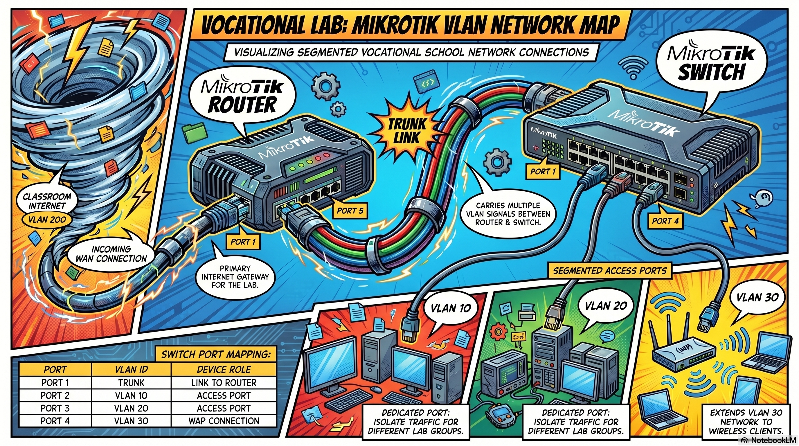
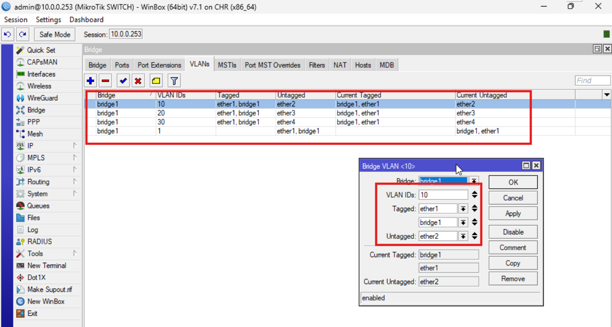

# MikroTik Router VLAN Configuration and Trunking Methods

<mark style="background-color:pink;"><strong>MIKROTIK VLAN NETWORK MAP</strong></mark>

<figure><figcaption>
MIKROTIK AS A <strong>ROUTER</strong>, MIKROTIK AS A <strong>SWITCH</strong> AND A <strong>WAP</strong>
</figcaption></figure>

Since our MikroTik devices do not have wireless capabilities, the process will focus on configuring the final ports of our switch as **access ports** (untagged) for each of the three VLANs. This ensures that any device plugged into those specific ports—including an external WAP—will automatically join the correct network.

Below are the steps to configure your network, integrating the classroom's internet VLAN 69.

<figure><figcaption>
UNI Eibar vocational training school's virtual desktop interface
</figcaption></figure>

We are going to use our own cloud or VDI platform ([https://cloud.uni.eus](https://cloud.uni.eus)) with several virtual machines. Plan is to use 4-5 machines: MikroTik OS x 2 (for both router and switch configurations); and three end devices with their OS (Windows or Linux). The logical scheme is as follows:

<figure><figcaption>
Challenge#3 logical scheme caption
</figcaption></figure>


#### Issue concerning the service network

While standard switches operate at **Layer 2** of the OSI model, they typically lack IP addresses for data forwarding, relying instead on **MAC addresses** and **ARP**. However, since MikroTik devices function as routers by default, we must establish a management or service network (a `/30` subnet, such as `10.0.0.0/30`, is an ideal choice) to interconnect the router and the switch when using them as intermediate hops.


### Router Configuration (MikroTik 1)

The router will handle the internet connection from the classroom and act as the gateway for your three internal VLANs.



### **WAN Setup (VLAN 69)**

Create a bridge for the WAN and add `ether1` to it. Since our classroom's router shall assign IPs automatically from 200 and above, we can either assign any available lower than 200 or create a DHCP Client and wait to be assigned one. Manually or not, assign it either to interface <kbd>ether1</kbd> or <kbd>bridge-WAN</kbd> to have a gateway correctly configured. &#x20;

<figure><figcaption></figcaption></figure> <figure><figcaption></figcaption></figure> <figure><figcaption></figcaption></figure>




### **Internal VLANs**

Create a second bridge for the LAN. Inside **Interfaces -> VLAN**, create your three internal VLANs (e.g., VLAN 10, 20, and 30) and attach them all to the LAN bridge.

<figure><figcaption></figcaption></figure> <figure><figcaption></figcaption></figure> <figure><figcaption></figcaption></figure>




### **IP Addressing & DHCP**

Assign a unique IP range to each internal VLAN interface (e.g., `192.168.10.254/24` for VLAN 10). Use the **DHCP Setup** wizard to create a DHCP pool for each individual VLAN interface.


Using `/30` CIDR subnet mask is way better than using address `10.0.0.1/24` as service network! But, **Why so?**


<figure> Addresses. Show the list of IPs assigned to VLAN 10, 20, and 30, plus the dynamic IP received by the VLAN 69 interface."><figcaption></figcaption></figure> <figure><figcaption></figcaption></figure> <figure><figcaption></figcaption></figure>




### **Internet Access (NAT)**

In the Firewall, create a masquerade rule so the internal VLANs can access the internet through the classroom's VLAN 69.

<figure> Firewall -> NAT. Show a rule with Action=masquerade and the Out. Interface set to your VLAN 69 interface."><figcaption></figcaption></figure> <figure><figcaption></figcaption></figure> <figure><figcaption></figcaption></figure> <figure><figcaption></figcaption></figure>




<figure><figcaption>
Interface connections between MikroTik devices: port 2-4 on router are in trunk mode to expand to new switches if needed; port 2 on switch is in trunk mode to expand to new switches were it needed; ports 3-5 ports are in access mode each on a VLAN. DHCP pools are set in the router and will assign IPs automatically in the given ranges.   
</figcaption></figure>


untagged = Access mode

tagged = Trunk mode


### Switch Configuration (MikroTik 2)

The switch will receive all VLANs on a "Trunk" port and distribute them to the "Access" ports.



### **The Trunk Ports**

Connect the router to the switch (e.g., Router `ether2` to Switch `ether1`). On the switch, create a bridge (e.g. <kbd>bridge1</kbd>) and add all physical ports to it. Go to **IP -> DHCP** Client and create a new connection for `bridge1`.



### **Defining Access Ports (PVID)**

Since you have no internal wireless, you must tell each port which VLAN it belongs to. Under **Bridge -> Ports**, change the **PVID** for your access ports (e.g., `ether2` PVID=10, `ether3` PVID=20, and `ether4` PVID=30).

<figure> Ports. Show the list of ports with their respective PVID values (10, 20, and 30) clearly visible."><figcaption></figcaption></figure>



### **VLAN Tagging Logic**

In the **Bridge -> VLANs** tab, create entries for each VLAN ID.

* **Tagged:** Your Trunk port (`ether1`) must be **Tagged** for all three VLANs (1, 10, 20, 30).
* **Untagged:** Assign the corresponding access port as **Untagged** for its VLAN (e.g., `ether4` as untagged for VLAN 30).&#x20;


#### **Two rules for a correct tagging**

1. Untagged column must not have repeated interfaces.
2. There must not be repeated interfaces in any current line (between columns tagged-untagged).&#x20;


<figure><figcaption></figcaption></figure>



### **Enable Filtering**

Finally, go to the Bridge settings and check the **VLAN Filtering** box. This activates the VLAN logic you just configured. Now go back to tab VLANs and check there is a new line at the bottom for VLAN 1 as untagged both `ether1` and `bridge`.&#x20;

<figure><figcaption></figcaption></figure>



#### Final Access

Because you have configured the ports in **access mode**, any device you plug into the port designated for VLAN 30 will automatically be on that network. To provide "WiFi" for that VLAN, simply connect your external WAP to that specific switch port.

<figure> DHCP Server -> Leases on the Router. Show a device (like a laptop or the external WAP) connected to one of the switch&#x27;s access ports successfully receiving an IP from the correct VLAN range."><figcaption></figcaption></figure>

Sources







