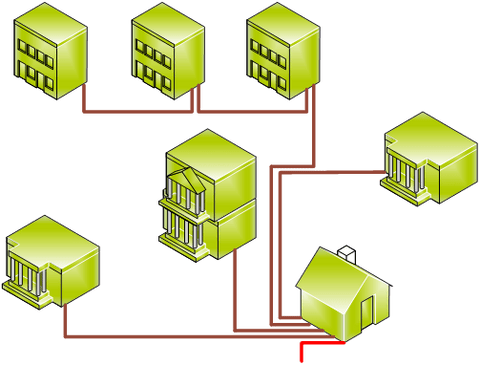
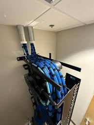
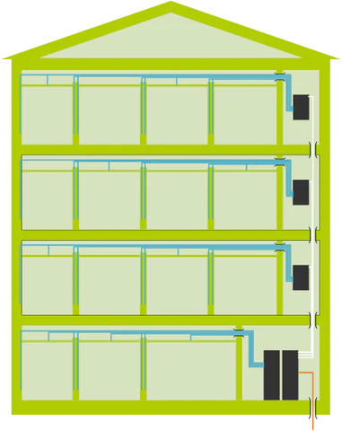
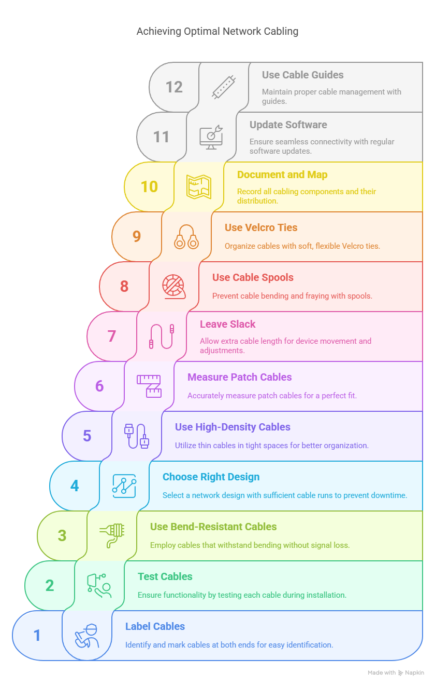

# 2.3 Structured cabling

> In telecommunications, structured cabling is building or campus cabling infrastructure that consists of a number of standardized smaller elements (hence structured) called subsystems. Structured cabling components include twisted pair and optical cabling, patch panels and patch cables.

<mark style="background-color:purple;">Structured cabling is the design and installation of a cabling system that will support multiple hardware uses and be suitable for today's needs and those of the future. With a correctly installed system, current and future requirements can be met, and hardware that is added in the future will be supported.</mark>

Structured cabling design and installation is governed by a set of standards that specify wiring data centers, offices, and apartment buildings for data or voice communications using various kinds of cable, most commonly Category 5e (Cat 5e), Category 6 (Cat 6), and fiber-optic cabling and modular connectors. These standards define how to lay the cabling in various topologies in order to meet the needs of the customer, typically using a central patch panel (which is often mounted in a 19-inch rack), from where each modular connection can be used as needed. Each outlet is then patched into a network switch (normally also rack-mounted) for network use or into an IP or PBX (private branch exchange) telephone system patch panel.

Lines patched as data ports into a network switch require simple straight-through patch cables at each end to connect a computer. Voice patches to PBXs in most countries require an adapter at the remote end to translate the configuration on 8P8C modular connectors into the local standard telephone wall socket. In North America no adapter is needed for certain uses: With ports wired in the preferred standard T568A pattern, for the 6P2C plugs most commonly used for single-line phone equipment (e.g. with RJ11), and 6P4C plugs used for two-line phones without power (e.g. with RJ14) and single-line phones with power (again RJ11), telephone connections are physically and electrically compatible with the larger 8P8C socket, but with ports wired as T568B, which is common but often in violation of the standard, only the first pair, i.e. _line 1_, works. RJ25 and RJ61 connections are physically but not electrically compatible, and cannot be used. In the United Kingdom, an adapter must be present at the remote end as the 6-pin BT socket is physically incompatible with 8P8C.

It is common to color-code patch panel cables to identify the type of connection, though structured cabling standards do not require it except in the demarcation wall field.

Cabling standards require that all eight conductors in Cat 5e/6/6A cable be connected.

IP phone systems can run the telephone and the computer on the same wires, eliminating the need for separate phone wiring.

Regardless of copper cable type (Cat 5e/6/6A), the maximum distance is 90 m for the permanent link installation, plus an allowance for a combined 10 m of patch cords at the ends.

Cat 5e and Cat 6 can both effectively run power over Ethernet (PoE) applications up to 90 m. However, due to greater power dissipation in Cat 5e cable, performance and power efficiency are higher when Cat 6A cabling is used to power and connect to PoE devices.

### Subsystems 

Structured cabling consists of six subsystems:

<figure><figcaption></figcaption></figure>

1. **Entrance facilities (EF)** is the point where the telephone company network ends and connects with the on-premises wiring belonging to the customer.
2. **Equipment rooms (ER)** house equipment and wiring consolidation points that serve the users inside the building or campus (so called **campus subsystems)**. A central position in the building is desired for the telecommunication rack cabinet or **communications rack,** a necessary element consisting of a simple and sturdy metal structure whose function is to house computer equipment, electronic and communication equipment. These cabinets keep arranged all the cables of the building.  Fiber cables are desired also here.&#x20;

<figure><figcaption>
Campus subsystem so as Interbuilding backbone cabling
</figcaption></figure>

3. **Backbone cabling** is the inter-building and intra-building cable connections in structured cabling between entrance facilities, equipment rooms and telecommunications closets. Backbone cabling consists of the transmission media, main and intermediate cross-connects and terminations at these locations. This system is mostly used in data centers. Fiber cable is usually held for speed reasons.&#x20;

<figure><figcaption></figcaption></figure>

4. **Horizontal cabling** wiring can be standard inside wiring **(IW)** or _plenum cabling_ and connects telecommunications rooms to individual outlets or work areas on the floor, usually through the **wireways**, **conduits** or **ceiling spaces** of each floor. A _horizontal cross-connect_ is where the horizontal cabling connects to a patch panel or punch-down block, which is connected by backbone cabling to the main distribution facility.

<figure><figcaption>
Horizontal, intrabuilding backbone, and entrance cabling within a structured cabling system
</figcaption></figure>

5. **Telecommunications rooms (TR)** or _telecommunications enclosure_ connects between the backbone cabling and horizontal cabling. Each plant can hold its communication rack provided with **patch panels**, linking the backbone and horizontal connections altogether.&#x20;
6. **Work-area components (WA)** connect end-user equipment to outlets of the horizontal cabling system. Each spot should provide various **connectors** to plug many devices at once.&#x20;

### Network installation steps

Achieving Optical network Cabling

<figure><figcaption></figcaption></figure>

Network wiring installation follows these fundamental steps:



#### <mark style="color:purple;">**Create a central**</mark>**&#x20;hub** for networking switch equipment:

_<mark style="color:$primary;">Select A Location For Your Server</mark>_

Essential network devices, such as servers, modems, switches, and firewalls, require a dedicated and secure environment for optimal performance. The ideal location should be:

* **Centrally positioned** for efficient cable routing to all network zones
* **Climate-controlled** to prevent equipment overheating
* **Secure** with restricted access to protect critical infrastructure
* **Well-ventilated** with adequate power and cooling systems



#### _<mark style="color:purple;">**Install outlets**</mark>_ at strategic locations:

_<mark style="color:$primary;">Plan Network Nodes & Measure Network Cable Distances</mark>_

Strategic node placement in your network determines its efficiency and performance. Consider these factors:

* **User density** and workspace layouts
* **Equipment requirements** for each location
* **Future expansion** possibilities
* **Cable length limitations** (maximum 100 meters for Ethernet cable)

Accurate measurements prevent costly material waste and ensure compliance with industry distance specifications.



#### <mark style="color:purple;">**Run network cables**</mark> through building infrastructure:

_<mark style="color:$primary;">Run Network Cables Through Infrastructure</mark>_

This phase demands meticulous execution to prevent performance-degrading damage:

**Best Practices:**

* Maintain proper **bend radius** to prevent signal degradation
* Avoid **parallel routing** with electrical cables
* Use **cable protection** in high-traffic areas
* **Label cables** systematically for future identification

**Special Considerations:**

* Older buildings may require additional access preparation
* Solid walls necessitate careful cutting techniques
* Fire-rated network cable selection for specific building areas



#### <mark style="color:purple;">**Terminate connections**</mark> at both ends:

_<mark style="color:$primary;">Position Wall Plates and Cut Precision Holes</mark>_

**Safety First:** Always disconnect power at the breaker before beginning electrical wiring work.

Wall plate positioning requires strategic planning:

* **Accessibility** for user convenience
* **Clearance** from electrical outlets and switches
* **Professional aesthetics** aligned with facility design
* **Future serviceability** for maintenance access

Use precision cutting tools to create clean, properly sized openings that maintain structural integrity.



#### <mark style="color:purple;">**Install faceplates**</mark> for professional appearance:

_<mark style="color:$primary;">Run Network Cables Through Infrastructure</mark>_

This phase demands meticulous execution to prevent performance-degrading damage:

**Best Practices:**

* Maintain proper **bend radius** to prevent signal degradation
* Avoid **parallel routing** with electrical cables
* Use **cable protection** in high-traffic areas
* **Label cables** systematically for future identification

**Special Considerations:**

* Older buildings may require additional access preparation
* Solid walls necessitate careful cutting techniques
* Fire-rated network cable selection for specific building areas



#### <mark style="color:purple;">**Test connections**</mark> for performance verification:

_<mark style="color:$primary;">Test Connection Performance</mark>_

Comprehensive testing ensures reliable network performance:

**Testing Phases:**

* **Continuity testing** for basic connectivity
* **Wire mapping** to verify proper termination
* **Performance testing** for bandwidth and signal quality
* **Certification testing** for compliance documentation

Professional testing equipment provides detailed reports that support warranty claims and performance verification.



#### <mark style="color:purple;">**Configure and connect**</mark> networked devices:

_<mark style="color:$primary;">Network Configuration and Optimization</mark>_

Final network configuration transforms installed infrastructure into a functional network:

* **Device configuration** for optimal performance
* **Security implementation** to protect network connections
* **Performance monitoring** to identify potential issues
* **Documentation creation** for ongoing maintenance



Professional cabling installation ensures proper cable arrangement, easy maintenance access, and scalable infrastructure that grows with your business needs.

### Network Installation Cost

<figure><figcaption></figcaption></figure>

The biggest factor in network installation cost is hardware. Beyond wiring, there’s a fair amount of other hardware that needs to be in place for a network to function:

* RJ45 connectors
* Data plugs
* Wallplates
* Wireless router and access points
* Patch panels
* Patch cables
* Conduits
* Ethernet switches
* Plastic grommets
* Velcro strips and cable ties

The more equipment you need to loop into your network–such as printers, security cameras, computer-assisted networking devices, etc.–the more data points, feet of cabling, and man-hours your network installation will need.


Find and attach a picture to the keywords above in your digital personal notebook.


Practical exercise

We want to set up a small workshop in room 012 and we've been asked to design the network installation. Take the dimensions of the room and design the network so you can put 6 computers.\
Once the design is done, make a budget with the necessary elements to assemble the network.

<figure><figcaption></figcaption></figure>

By consulting the catalogues of the company [_Unex_](https://files.unex.net/es/publicaciones/unex-catalogo-general-lista-de-precios.pdf) (specialized in wireways) and the website [_www.pccomponentes.com_](https://www.pccomponentes.com) (specialized in components) estimate the cost of the network installation.&#x20;

* [Work space solutions](https://files.unex.net/es/publicaciones/unex-soluciones-aislantes-para-espacios-de-trabajo.pdf)

_Unex budget_:

<table><thead><tr><th width="137">Material name</th><th width="137">Reference</th><th width="137">Amount in meters (m) or in units (u)</th><th>Price per meter or unit</th><th>Total</th></tr></thead><tbody><tr><td><em>Canales</em></td><td> </td><td> </td><td> </td><td> </td></tr><tr><td><em>Ángulo exterior</em></td><td> </td><td> </td><td> </td><td> </td></tr><tr><td><em>Ángulo interior</em></td><td> </td><td> </td><td> </td><td> </td></tr><tr><td><em>Tapa final</em></td><td> </td><td> </td><td> </td><td> </td></tr><tr><td><em>Simon 27</em></td><td> </td><td> </td><td> </td><td> </td></tr><tr><td><strong>Total sum</strong></td><td> </td><td></td><td></td><td></td></tr></tbody></table>

_PCcomponentes budget_:

| Material                             | Reference | Amount | Price | Total |
| ------------------------------------ | --------- | ------ | ----- | ----- |
| _Bobina Cable UTP Cat 6 305 m_       |           |        |       |       |
| _Rj45-hembra Cat.6_                  |           |        |       |       |
| _Equip Patch Panel 24 puertos Cat 6_ |           |        |       |       |
| _Armario Rack_                       |           |        |       |       |
| Eskaera Osoaren Zenbatekoa  à        |           |        |       |       |

