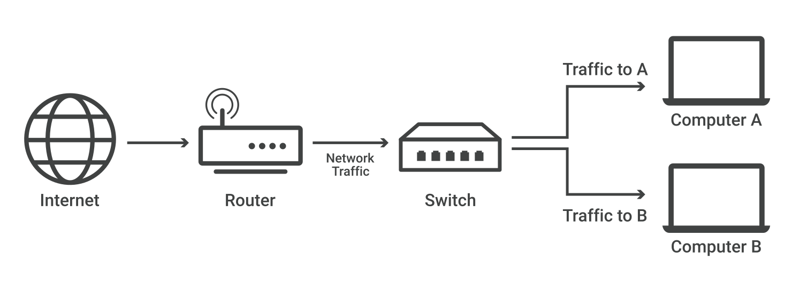

# 1.3 Network Interconnection Elements

Network devices are physical devices that allow hardware on a computer network to communicate and interact with each other. Network devices like hubs, repeaters, bridges, switches, routers, gateways, and brouter help manage and direct data flow in a network. They ensure efficient communication between connected devices by controlling data transfer, boosting signals, and linking different networks. Each device serves a specific role, from simple data forwarding to complex routing between networks. In this article, we are going to discuss different types of network devices in detail.

<figure><figcaption>
Types of Network Devices
</figcaption></figure>

### Functions of Network Devices 

* Network devices help to send and receive data between different devices.
* Network devices allow devices to connect to the network efficiently and securely.
* Network devices improves network speed and manage data flow better.
* It protects the network by controlling access and preventing threats.
* Expand the network range and solve signal problems.

### Common Types of Networking Devices and Their Uses 

Network devices work as a mediator between two devices for transmission of data, and thus play a very important role in the functioning of a computer network. Below are some common network devices used in modern networks:

* Access Point
* Modems
* Firewalls
* Repeater
* Hub
* Bridge
* Switch
* Routers
* Gateway
* Brouter
* NIC

### Access Point 

An access point in networking is a device that allows wireless devices, like smartphones and laptops, to connect to a wired network. It creates a Wi-Fi network that lets wireless devices communicate with the internet or other devices on the network. Access points are used to extend the range of a network or provide Wi-Fi in areas that do not have it. They are commonly found in homes, offices, and public places to provide wireless internet access.

### Modems 

Modem is also known as modulator/demodulator is a network device that is used to convert digital signal into analog signals of different frequencies and transmits these signals to a modem at the receiving location. These converted signals can be transmitted over the cable systems, telephone lines, and other communication mediums. A modem is also used to convert an analog signal back into digital signal. Modems are generally used to access the internet by customers of an Internet Service Provider or ISP (Euskaltel, Vodafone, Manka, Izarkom...).

#### **Types of Modems** 

There are four main types of modems:

* **DSL Modem**: Uses regular phone lines to connect to the internet but it is slower compared to other types.
* **Cable Modem**: Sends data through TV cables, providing faster internet than DSL.
* **Wireless Modem**: Connects devices to the internet using Wi-Fi relying on nearby Wi-Fi signals.
* **Cellular Modem**: Connects to the internet using mobile data from a cellular network not Wi-Fi or fixed cables.

### Firewalls 

A firewall is a network security device that monitors and controls the flow of data between your computer or network and the internet. It acts as a barrier, blocking unauthorized access while allowing trusted data to pass through. Firewalls help protect your network from hackers, viruses, and other online threats by filtering traffic based on security rules. Firewalls can be physical devices (hardware), programs (software), or even cloud-based services, which can be offered as SaaS, through public clouds, or private virtual clouds.

### Repeater 

A repeater operates at the physical layer. Its main function is to amplify (i.e., regenerate) the signal over the same network before the signal becomes too weak or corrupted to extend the length to which the signal can be transmitted over the same network. When the signal becomes weak, they copy it bit by bit and regenerate it at its star topology connectors connecting following the original strength. It is a 2-port device.

### **Hub** 

A [hub ](./#hub)is a multiport repeater. A hub connects multiple wires coming from different branches, for example, the connector in [star topology](../1.2-computer-network-topologies.md#star-topology) which connects different stations. Hubs cannot filter data, so data packets are sent to all connected devices.  In other words, the collision domain of all hosts connected through Hub remains one.  Also, they do not have the intelligence to find out the best path for data packets which leads to inefficiencies and wastage.

#### **Types of Hub** 

* **Active Hub:** These are the hubs that have their power supply and can clean, boost, and relay the signal along with the network. It serves both as a repeater as well as a wiring center. These are used to extend the maximum distance between nodes.
* **Passive Hub:** These are the hubs that collect wiring from nodes and power supply from the active hub. These hubs relay signals onto the network without cleaning and boosting them and can't be used to extend the distance between nodes.
* **Intelligent Hub:** It works like an active hub and includes remote management capabilities. They also provide flexible data rates to network devices. It also enables an administrator to monitor the traffic passing through the hub and to configure each port in the hub.

### **Bridge** 

A bridge operates at the data link layer. A bridge is a repeater, with add on the functionality of filtering content by reading the MAC addresses of the source and destination. It is also used for interconnecting two LANs working on the same protocol. It typically connects multiple network segments and each port is connected to different segment. A bridge is not strictly limited to two ports, it can have multiple ports to connect and manage multiple network segments. Modern multi-port bridges are often called Layer 2 switches because they perform similar functions.

#### **Types of Bridges** 

* **Transparent Bridges:** These are the bridge in which the stations are completely unaware of the bridge's existence i.e. whether or not a bridge is added or deleted from the network, reconfiguration of the stations is unnecessary. These bridges make use of two processes i.e. bridge forwarding and bridge learning.
* **Source Routing Bridges:** In these bridges, routing operations is performed by the source station and the frame specifies which route to follow. The host can discover the frame by sending a special frame called the discovery frame, which spreads through the entire network using all possible paths to the destination.

### **Switch** 

A [switch ](./#switch)is a multiport bridge with a buffer designed that can boost its efficiency (a large number of ports imply less traffic) and performance. A switch is a data link layer device. The switch can perform error checking before forwarding data, which makes it very efficient as it does not forward packets that have errors and forward good packets selectively to the correct port only.  In other words, the switch divides the collision domain of hosts, but the broadcast domain remains the same.

#### **Types of  Switch** 

* **Unmanaged Switches:** These switches have a simple plug-and-play design and do not offer advanced configuration options. They are suitable for small networks or for use as an expansion to a larger network.
* **Managed Switches:** These switches offer advanced configuration options such as [VLANs](https://www.geeksforgeeks.org/computer-networks/virtual-lan-vlan/), [QoS](https://www.geeksforgeeks.org/computer-networks/difference-between-quality-of-service-qos-and-quality-of-experience-qoe/), and link aggregation. They are suitable for larger, more complex networks and allow for centralized management.
* **Smart Switches:** These switches have features similar to managed switches but are typically easier to set up and manage. They are suitable for small- to medium-sized networks.
* **Layer 2 Switches:** These switches operate at the Data Link layer of the OSI model and are responsible for forwarding data between devices on the same network segment.
* **Layer 3 switches:** These switches operate at the Network layer of the OSI model and can route data between different network segments. They are more advanced than Layer 2 switches and are often used in larger, more complex networks.
* **PoE Switches**: These switches have Power over Ethernet capabilities, which allows them to supply power to network devices over the same cable that carries data.
* **Gigabit switches:** These switches support Gigabit Ethernet speeds, which are faster than traditional Ethernet speeds.
* **Rack-Mounted Switches:** These switches are designed to be mounted in a server rack and are suitable for use in data centers or other large networks.
* **Desktop Switches:** These switches are designed for use on a desktop or in a small office environment and are typically smaller in size than rack-mounted switches.
* **Modular Switches**: These switches have modular design that allows for easy expansion or customization. They are suitable for large networks and data centers.

### **Router** 

A [router ](./#router)is a device like a switch that routes data packets based on their IP addresses. The router is mainly a Network Layer device. Routers normally connect LANs and [WANs](https://www.geeksforgeeks.org/computer-science-fundamentals/wan-full-form/) and have a dynamically updating [routing table](https://www.geeksforgeeks.org/computer-networks/routing-tables-in-computer-network/) based on which they make decisions on routing the data packets. The router divides the broadcast domains of hosts connected through it.

### **Gateway** 

A gateway, as the name suggests, is a passage to connect two networks that may work upon different networking models. They work as messenger agents that take data from one system, interpret it, and transfer it to another system. Gateways are also called protocol converters and can operate at any network layer. Gateways are generally more complex than switches or routers.

### **NIC** 

NIC or network interface card is a network adapter that is used to connect the computer to the network. It is installed in the computer to establish a LAN.  It has a unique ID that is written on the chip, and it has a connector to connect the cable to it. The cable acts as an interface between the computer and the router or modem. NIC is a layer 2 device which means that it works on both the physical and data link layers of the network model.


### What is the difference between a switch and a router?

Routers select paths for data packets to cross networks and reach their destinations. Routers do this by connecting with different networks and forwarding data from network to network — including LANs, [wide area networks (WANs)](https://www.cloudflare.com/learning/network-layer/what-is-a-wan/), or [autonomous systems](https://www.cloudflare.com/learning/network-layer/what-is-an-autonomous-system/), which are the large networks that make up the Internet.

In practice, what this means is that routers are necessary for an Internet connection, while switches are only used for interconnecting devices. Homes and small offices need routers for Internet access, but most do not need a network switch, unless they require a large amount of Ethernet\* ports. However, large offices, networks, and data centers with dozens or hundreds of computers usually do require switches.

_\*Ethernet is a layer 2_ [_protocol_](https://www.cloudflare.com/learning/network-layer/what-is-a-protocol/) _for sending data between devices. Unlike WiFi, Ethernet requires a physical connection via an Ethernet cable._



### What is a layer 2 switch? What is a layer 3 switch?

Network switches can operate at either [OSI](https://www.cloudflare.com/learning/ddos/glossary/open-systems-interconnection-model-osi/) layer 2 (the data link layer) or [layer 3](https://www.cloudflare.com/learning/ddos/layer-3-ddos-attacks/) (the [network layer](https://www.cloudflare.com/learning/network-layer/what-is-the-network-layer/)). Layer 2 switches forward data based on the destination MAC address (see below for definition), while layer 3 switches forward data based on the destination [IP address](https://www.cloudflare.com/learning/dns/glossary/what-is-my-ip-address/). Some switches can do both.

Most switches, however, are layer 2 switches. Layer 2 switches most often connect to the devices in their networks using Ethernet cables. Ethernet cables are physical cables that plug into devices via Ethernet ports.



### What is an unmanaged switch? What is a managed switch?

An unmanaged switch simply creates more Ethernet ports on a LAN, so that more local devices can access the Internet. Unmanaged switches pass data back and forth based on device MAC addresses.

A managed switch fulfills the same function for much larger networks, and offers network administrators much more control over how traffic is prioritized. They also enable administrators to set up Virtual LANs (VLANs) to further subdivide a local network into smaller chunks.


