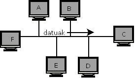

# 3.5.1 Filling Routing Tables

<mark style="background-color:purple;">Using</mark> <mark style="background-color:purple;"></mark><mark style="background-color:purple;">**routing**</mark><mark style="background-color:purple;">, devices on the network decide the path of a packet.</mark>

<figure><figcaption>
Network showing the current example
</figcaption></figure>

If host A (IP=<kbd>210.23.5.14</kbd>) wants to communicate with host C (IP=<kbd>210.23.5.27</kbd>), it will create packets with the information it wants to send. At the Network layer, the IP addresses of the sender (A) and the destination (C) will be added to the packet header, and the packets will be passed to the Link layer. If the Link layer does not know C's MAC address, the ARP protocol will make a request to obtain the MAC address. When the sender knows the destination's MAC address, it will add the MAC addresses of the sender and the destination to the packet header, and the packet will be passed to the physical layer to perform the transmission.

But now, let's assume that host C (IP = 190.200.23.5) is **not on the same network** as host A (IP = 210.23.5.14). When the ARP protocol sends a broadcast message to obtain the MAC address, no one will reply. To solve this problem, we have **routers**. A router is a device composed of hardware and software that connects computer networks, operating at the **third layer (Network layer) of the OSI model**. This device connects network segments as well as entire networks. It allows data packets to pass between networks, based on information from the network layer.

To easily understand, a router is a device that must have multiple IPs (and thus multiple network interfaces) to manage data traffic between different IP networks; otherwise, if connected directly, they would not communicate. The network of networks, the Internet, is connected by routers. When a datagram is sent from one computer to another, the router chooses the **best path** (_ibilbiderik onena_) among the networks it is connected to. It then directs the data packets through the most appropriate network segments and ports. We call this **routing**. The parameters used for this decision include the status of data traffic, the protocol used, and the network address, among others. The average user will be familiar with the ADSL router, which enables Internet access for the home or office network. Ultimately, it links two networks: it connects the home or office Local Area Network (LAN) with the external network (WAN).

<figure><figcaption>
Two networks conncected by a router
</figcaption></figure>

Now, when a host sends an ARP request to find the MAC address corresponding to an IP and no one responds to that request, it will send the packets to a router that is on its network. This will be the network's gateway or **default gateway**. If the gateway is not specified on computers, communication will only be possible within the network where that computer is located, as it will not know how to exit that network. When a packet passes from one router to another (i.e., crosses a network), we say it has made a **hop** (_hurrengo jauzia_). The main goal of the routers involved in a transmission is to make the **minimum possible number of hops**.

To achieve this goal, routers maintain constant communication among themselves, knowing at all times which paths are broken or what the traffic status is at each point. The information they obtain is stored in a special table. We call this table the **routing table** (_bideratze-taula_). Thus, when a packet arrives at a router, it will check its routing table to see if the packet's destination address is present. If it is in the table, in addition to the destination IP address, the path to reach the destination will be marked. If, on the other hand, it is not in the table, it will make a request to all ports to find out where the packet should pass. Once the response is received, it will enter the IP/port into its routing table and, in the future, will send packets destined for that machine directly.

<figure><figcaption></figcaption></figure>

Here we can see some interconnected networks and an example of a routing table. The routing table for the R2 router in the previous scheme would be this:

| Destination Network Address | Destination Subnet Mask | Next Hop (Hurrengo saltoa)  | Interface (Interfazea) |
| --------------------------- | ----------------------- | --------------------------- | ---------------------- |
| 192.168.1.0                 | 255.255.255.0           | R1/192.168.2.1              | 192.168.2.2            |
| 192.168.2.0                 | 255.255.255.0           | Direct (Zuzena)/192.168.2.2 | 192.168.2.2            |
| 192.168.3.0                 | 255.255.255.0           | Direct (Zuzena)/192.168.3.1 | 192.168.3.1            |
| 192.168.4.0                 | 255.255.255.0           | R3/192.168.3.2              | 192.168.3.1            |
| 192.168.5.0                 | 255.255.255.0           | R3/192.168.3.2              | 192.168.3.1            |

However, the above is not the minimum routing table for router R2, because we can simplify it. To simplify this, we would have to remove the repeated entries. In the example, we can see that the "next hop" and "interface" in the last 2 lines are the same; therefore, we could combine them.

How? By placing <kbd>**Default**</kbd> in the "Network Address" field and <kbd>**0.0.0.0**</kbd> in the mask. This path, placed in the last line of the routing table, indicates that if none of the previous paths were taken, the packet must go through this one. The table would look like this:

| Destination Network Address | Destination Subnet Mask | Next Hop                    | Interface       |
| --------------------------- | ----------------------- | --------------------------- | --------------- |
| 192.168.1.0                 | 255.255.255.0           | R1/192.168.2.1              | 192.168.2.2     |
| 192.168.2.0                 | 255.255.255.0           | Direct (Zuzena)/192.168.2.2 | 192.168.2.2     |
| 192.168.3.0                 | 255.255.255.0           | Direct (Zuzena)/192.168.3.1 | 192.168.3.1     |
| **Default**                 | **0.0.0.0**             | **R3/192.168.3.2**          | **192.168.3.1** |
