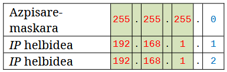
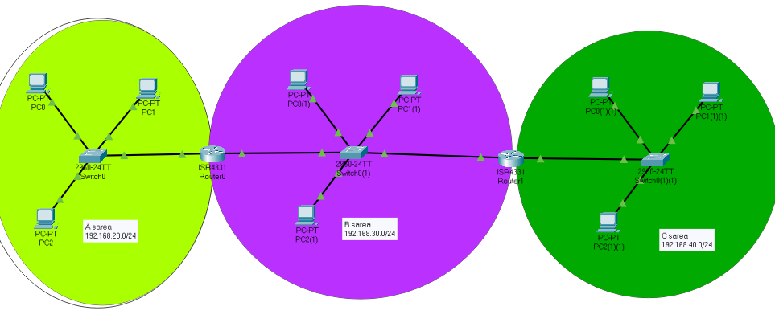
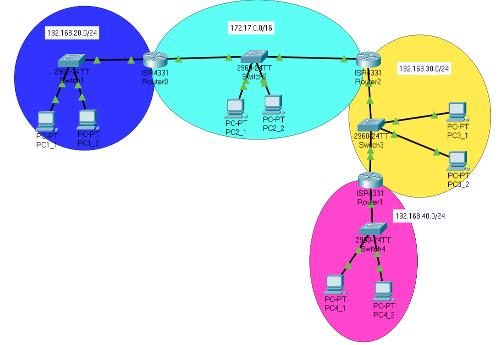

# 3.7 Exercises

### Base Conversions

1. Convert the decimal number **(98)₁₀** into binary.
2. Convert the binary number **(10011)****2** into decimal.
3. Convert the octal number **(157)****8** into decimal.
4. Convert the octal number **(26)****8** into decimal.
5. Convert the hexadecimal **(BA)****16** into decimal.
6. Convert the hexadecimal **(FF8)****16** into decimal.
7. Convert the decimal **(1016)****10** into hexadecimal.
8. Divide the binary number **(11110)₂** by **(101)₂**
9. Find the 2's complement of the binary number **(1011)₂**.
10. Multiply the binary numbers **(1110)₂** and **(1001)₂**.
11. Subtract the binary numbers **(11010)₂** and **(10110)₂**.
12. Add the binary numbers **(11011)₂** and **(10100)₂**.

Answers 1-12

**1. (1100010)****2****​, 8. (110)****2****​, 9. (0101)****2****, 10. (1111110)****2****, 11. (00100)****2****​​, 12. (101111)****2**

***

### [IP Address, Subnet Mask](#user-content-fn-1)[^1] and Classes

1. Given host IP `192.168.100.25/30` calculate the network IP it corresponds, the broadcast address and the valid range.

Answer 1

<figure><figcaption></figcaption></figure>

2. Given host IP `192.168.100.16/28` calculate the network IP it corresponds, the broadcast address and the valid range.

Answer 2

<figure><figcaption></figcaption></figure>

3. Given host IP `192.168.100.66/27` calculate the network IP it corresponds, the broadcast address and the valid range.

Answer 3

<figure><figcaption></figcaption></figure>

4. Fill the gaps:

| IP Address    | Network Class | Private or Public | Network Address | Host (single) | Subnet Mask   | Broadcast      |
| ------------- | ------------- | ----------------- | --------------- | ------------- | ------------- | -------------- |
| 192.168.2.118 | 
 
   | Private           | 
 
     | 
 
   | 255.255.255.0 | 
 
    |
| 
 
   | 
 
   |                   | 18.0.0.0        | 0.98.54.231   | 
 
   | 
 
    |
| 
 
   | 
 
   |                   | 
 
     | 0.0.98.12     | 
 
   | 132.78.255.255 |
| 221.78.9.53   | 
 
   |                   | 
 
     | 
 
   | 
 
   | 221.78.9.255   |
| 191.255.78.2  | B             | Public            | 
 
     | 
 
   | 
 
   | 
 
    |
| 1.6.5.9       | A             |                   | 
 
     | 
 
   | 
 
   | 
 
    |
| 192.168.7.212 | 
 
   |                   | 192.168.7.0     | 
 
   | 
 
   | 
 
    |
| 
 
   | 
 
   |                   | 
 
     | 0.0.0.254     | 
 
   | 212.67.32.255  |

***

### Subnetting

5. Suppose class B addresses use 20 bits instead of 16 to identify the network. How many subnets could be located with this new format? How many bits would be left to assign the host?

Answer 5

16 new subnets and 12 bits left to hosts &#x20;

6. The Internet Class B address submask is <kbd>255.255.240.0</kbd>. How many computers can be assigned to each subnet, at most?

Answer 6

4094 IPs

7. The Internet Class B address submask is <kbd>255.255.0.0</kbd>. How many computers can be assigned to each subnet, at most?
8.  **Subnetting for Host Requirements**

    You are using a Class C network address: **192.168.20.0/24**. You need to divide this network into equal-sized subnets, where each resulting subnet can support at least **14 usable hosts**.

    1. What is the minimum number of host bits that must remain available (H) in the Host ID field to satisfy the requirement (where usable hosts = 2H - 2)?
    2. How many bits must be borrowed (stolen) from the Host ID field to meet this minimum requirement?
    3. What is the new Subnet Mask (in dotted-decimal notation) for these subnets?
    4. How many total subnets can be created with this new mask?

Answer 8

a. 4 bits to hosts

b. 4 bits borrowed to network

c. 255.255.255.240

d. 16 subnets

9. **Calculating Subnet Details from CIDR Notation**\
   Consider the Class C network **200.10.5.0/24**. An administrator applies the subnet mask **255.255.255.192**.
   1. How many bits were used to identify the subnet portion (Network ID) of the address (i.e., how many "1" bits are in the mask)?
   2. How many usable host IP addresses are available in each resulting subnet?
   3. What are the Network Address and the Broadcast Address for the **second** subnet (Subnet 1, starting count from 0) created by this mask?

Answer 9

a. **2 bits more** borrowed up to 26 from 24 to subnetting, so 22 = 4 NEW subnets. CIDR notation /26

b. 62 hosts on each subnet

c. 200.10.5.64/26 network and 200.10.5.127 broadcast

10. **Subnetting for Class B Address**\
    You are working with the Class B network address **150.10.0.0** (default mask: 255.255.0.0 or /16). You apply the custom subnet mask: **255.255.240.0**.
    1. Convert the custom subnet mask into binary notation to determine how many bits were stolen from the Host ID field.
    2. How many subnets are created by applying this new mask? (Hint: 2stolen bits).
    3. What is the maximum number of usable host addresses available in each subnet? (Hint: 2H - 2).

Answer 10

a. 4 bits

b. 16 subnets

c. 14 hosts

11. **Identifying Network and Broadcast Addresses**\
    Given the IP address **192.168.1.130** and the custom subnet mask **255.255.255.128** (/25):
    1. Convert the IP address and the mask into binary format (specifically the last octet).
    2. Calculate the Network Address by performing a [logical **AND**](3.1-base-conversions-for-number-system/3.1.1-binary-number-system.md#binary-multiplication) operation between the IP address and the mask.
    3. Calculate the Broadcast Address by performing a [logical **OR**](3.1-base-conversions-for-number-system/3.1.1-binary-number-system.md#binary-addition) operation between the IP address and the inverse of the mask (NOT mask).
    4. What is the range of usable host IP addresses within this subnet?
12. **Determining the Mask from Subnet Count**\
    You have a Class A network address **45.0.0.0/8** and need to divide it into **32 equal-sized subnets**.
    1. How many bits must be borrowed (stolen) from the Host ID field to accommodate 32 subnets?
    2. What is the resulting Subnet Mask in dotted-decimal notation?
    3. Specify the Network Address, Subnet Mask, and Broadcast Address for the **10th** subnet created.
13. **Classification of Special IP Addresses**\
    Determine the classification for each of the following IP addresses within the context of the subnet **172.16.16.0/20** (Mask 255.255.240.0). Classify each as: **Network Address (N)**, **Broadcast Address (B)**, **Usable Host Address (H)**, or **Reserved/Special Address (R)**.

| IP Address    | Classification | Justification (Why?) |
| ------------- | -------------- | -------------------- |
| 172.16.16.0   |                |                      |
| 172.16.31.255 |                |                      |
| 172.16.16.1   |                |                      |
| 127.0.0.1     |                |                      |
| 172.16.32.1   |                |                      |

14. **Identifying Class and Default Mask**\
    For each of the following IP addresses, determine its traditional IP Address Class (A, B, or C) and its corresponding Default Subnet Mask (in dotted-decimal notation):

| IP Address    | Class | Default Subnet Mask |
| ------------- | ----- | ------------------- |
| 196.44.12.5   |       |                     |
| 11.25.1.100   |       |                     |
| 145.200.7.200 |       |                     |

15. **Host ID and Subnet ID Boundaries**\
    You are using a Class C network **192.168.100.0/24** and borrow **4 bits** for subnetting.
    1. What is the resulting Subnet Mask (dotted-decimal and CIDR notation)?
    2. Determine the Network Address, First Usable Host IP, Last Usable Host IP, and Broadcast Address for the subnet where the borrowed bits are **1101** (binary).
16. **Calculating the Subnet Mask in Binary**\
    If you have a default Class B address (16 bits for Network ID) and you borrow **6 additional bits** for subnetting, calculate the resulting subnet mask in two formats:
    1. Binary notation (32 bits).
    2. Dotted-decimal notation.
    3. How many total subnets are created?
17. **Determining Coexistence on a Subnet**\
    Given the IP address pair and the custom subnet mask, determine if the two addresses belong to the same logical network (subnet). Show the Network ID calculation (using the AND function principle):

| IP Address 1  | IP Address 2   | Custom Subnet Mask | Same Network? (Yes/No) |
| ------------- | -------------- | ------------------ | ---------------------- |
| 192.168.10.50 | 192.168.10.150 | 255.255.255.192    |                        |
| 170.102.1.38  | 170.102.58.72  | 255.255.252.0      |                        |


#### How to check the Network Address that is belong an IP

_"Are these two IPs belong in the same Network?"_

1. First sight checking: \
   both IP addresses must share the same Subnet Mask. Besides, for each byte in the subnet mask with value 255 both IPs must share the same value in their IPs. For example:\
   
2. [Using the AND function principle](3.1-base-conversions-for-number-system/3.1.1-binary-number-system.md#binary-multiplication): multiply each IP Address with its Subnet Mask; if the <mark style="background-color:purple;">resulting Network Address is the same</mark> for both, they belong in the same network.


18. **Fast Subnet Matching**
    1. pc-01 (Subnet Mask: 255.255.0.0 eta IP Address: 172.16.24.78)\
       pc-02 (Subnet Mask: 255.255.0.0 eta IP Address: 172.27.33.27)
    2. pc-01 (Subnet Mask: 255.255.0.0 eta IP Address: 172.122.56.78)\
       pc-02 (Subnet Mask: 255.255.0.0 eta IP Address: 191.122.56.27)
    3. pc-01 (Subnet Mask: 255.255.255.0 eta IP Address: 192.234.56.78)\
       pc-02 (Subnet Mask: 255.255.255.0 eta IP Address: 192.123.56.27)
    4. pc-01 (Subnet Mask: 255.255.255.0 eta IP Address: 192.234.56.78)\
       pc-02 (Subnet Mask: 255.255.255.0 eta IP Address: 192.234.37.27)
    5. pc-01 (Subnet Mask: 255.255.255.0 eta IP Address: 192.234.56.27)\
       pc-02 (Subnet Mask: 255.255.255.0 eta IP Address: 192.234.56.33)
19. <mark style="color:purple;">**Exercise from scratch in the whiteboard**</mark>\
    <kbd><mark style="color:purple;">10.15.0.0/16<mark style="color:purple;"></kbd> <mark style="color:purple;"></mark><mark style="color:purple;">divided into subnets where the condition is to have at least 3000 host per each. Lastly, tell everything about the 2nd subnet (net, first addr, last addr, br).</mark>&#x20;

Answer 19

<figure><figcaption></figcaption></figure>

4094 host available on each (>3000 ok).&#x20;

***

### Routing

1. **Analyzing Routing Table Decisions**\
   Router R2 maintains a routing table that maps destination networks to outgoing interfaces. The core function of a router is to forward packets based on network-layer information.\
   Analyze the simplified routing table excerpt below (similar to the examples provided in the source material).
   1. A packet arrives at R2 destined for the IP address `192.168.1.55`. Which route entry (Network Address) will R2 select?
   2. When forwarding this packet, what is the IP address of the **Next Hop** (_Hurrengo jauzia_) device?
   3. If a packet arrives destined for an IP outside of any listed network (e.g., `200.1.1.1`), which route entry will R2 select, and what is the IP address of the outgoing Interface (Iface)?
   4. Draw a possible picture of the network corresponding to the Routing Table below.

| Destination Network Address (Sare-helbidea) | Mask            | Next Hop (Hurrengo jauzia) | Interface (Iface) |
| ------------------------------------------- | --------------- | -------------------------- | ----------------- |
| `192.168.1.0`                               | `255.255.255.0` | `R1/192.168.2.1`           | `192.168.2.2`     |
| `192.168.2.0`                               | `255.255.255.0` | `Direct`                   | `192.168.2.2`     |
| `192.168.3.0`                               | `255.255.255.0` | `Direct`                   | `192.168.3.1`     |
| `Default`                                   | `0.0.0.0`       | `R3/192.168.3.2`           | `192.168.3.1`     |

2. **Router Function and the Network Layer**\
   A router is a device consisting of hardware and software used to connect computer networks. It plays a critical role in inter-network communication.
   1. On which layer of the **OSI reference model** (_OSI eredua_) does a router primarily operate?
   2. When a router forwards data packets between networks, it does so based on information found in the header of the packet. What is the name given to the data unit at this layer, and what is the key piece of addressing information contained within it that guides the routing decision?
   3. The process of routing determines the _best path_ (_ibilbiderik onena_) for a packet to reach its destination. What is the term used to describe the metric (measurement) that indicates whether a specific path is good or not, which should ideally have the lowest possible value?
3.  **Local vs. Remote Traffic and Default Gateway**

    Consider a host (Host A) with IP address **192.168.1.10/24**. Host A wants to communicate with Host B (**192.168.1.50**) and Host C (**192.168.5.50**). The local router (default gateway) is at **192.168.1.1**.

    1. When Host A sends a message to Host B, will it need to pass through the router? Explain the decision Host A makes based on IP addressing.
    2. When Host A sends a message to Host C, Host A detects that Host C is not on its local network. What network parameter, known as the **Default Gateway** (_sarbide-atea_), must be configured on Host A to allow it to send the packet outside the local network?
    3. If Host A's configuration lacks the default gateway setting, what is the consequence regarding communication with Host C?
4.  Fill the routing tables of routers R1, R2, R3. 

    <figure><figcaption></figcaption></figure>

### Cisco Packet Tracer

1.  **Starting with simulation tool** \
    Simulate the net below and make the required connectivity tests provided in ICMP.&#x20;

    <figure><figcaption></figcaption></figure>
2. **Simulating Classful Addressing**\
   Simulate a private network for 200 devices choosing the IP addresses and subnet masks that you see fit best.&#x20;


Only draw 6 devices.


3. **Simulating Classful Addressing**\
   Simulate a private network for 20.000 devices choosing the IP addresses and subnet masks that you see fit best.&#x20;


Only draw 12 devices.


4. **Subnet Matching** \
   Simulate a network with 4 computers inside. Use the table below to assign their IP and subnet masks. Which devices are connected to each other? Why so?

| PC name   | IP Address      | Subnet Mask     |
| --------- | --------------- | --------------- |
| computer1 | `192.168.1.1`   | `255.255.255.0` |
| computer2 | `192.168.1.2`   | `255.255.255.0` |
| computer3 | `172.20.19.145` | `255.255.0.0`   |
| computer4 | `10.13.126.7`   | `255.0.0.0`     |

5. **Subnet Matching, Routing Tables and Troubleshooting**\
   Make the same network so as the connectivity among all nodes is guaranteed. Use both `ping` and `tracert` commands.  

<figure><figcaption></figcaption></figure>

6. **Subnet Matching and troubleshooting**\
   Make the same network in Packet Tracer and configure all devices so all are connected. Use both `ping` and `tracert` commands.  

<figure><figcaption></figcaption></figure>

7. **Routing Tables**\
   Fill the routing tables of the routers in this Packet Tracer file [here](https://drive.google.com/file/d/19MUaMtnsMoU0iuYiz7PzDnbhbAQbvFoD/view?usp=sharing).&#x20;
8. <mark style="color:purple;">**Simulating Subnetting**</mark> \ <mark style="color:purple;">Given the following network</mark> <mark style="color:purple;"></mark><mark style="color:purple;">`10.0.0.0/8`</mark> \ <mark style="color:purple;">Divide this network into 16 equal-sized subnets and indicate the network address (in</mark> <mark style="color:purple;"></mark><mark style="color:purple;">`X.X.X.X/M`</mark> <mark style="color:purple;"></mark><mark style="color:purple;">format) and the broadcast address for the first three and the last three subnets.</mark> \ <mark style="color:purple;">Lastly, make that same network configuration in Packet Tracer; use the connectivity checkings in ICMP and fix the issues if needed.</mark>&#x20;
9. <mark style="color:purple;">Given the following network:</mark> <mark style="color:purple;"></mark><mark style="color:purple;">`10.0.192.0/18`</mark>\ <mark style="color:purple;">Divide this network into 8 equal-sized subnets and, for each subnet, indicate the network address (in</mark> <mark style="color:purple;"></mark><mark style="color:purple;">`X.X.X.X/M`</mark> <mark style="color:purple;"></mark><mark style="color:purple;">format) and the broadcast address.</mark> \ <mark style="color:purple;">Lastly, make that same network configuration in Packet Tracer; use the connectivity checkings in ICMP and fix the issues if needed.</mark>&#x20;
10. <mark style="color:purple;">Given the following network:</mark> <mark style="color:purple;"></mark><mark style="color:purple;">`192.168.23.128/25`</mark> \ <mark style="color:purple;">Divide this network into 4 equal-sized subnets and, for each subnet, indicate the network address (in</mark> <mark style="color:purple;"></mark><mark style="color:purple;">`X.X.X.X/M`</mark> <mark style="color:purple;"></mark><mark style="color:purple;">format), the broadcast address, and the usable IP range for hosts.</mark>\ <mark style="color:purple;">Lastly, make that same network configuration in Packet Tracer; use the connectivity checkings in ICMP and fix the issues if needed.</mark>&#x20;
11. <mark style="color:purple;">Given the following subnet:</mark> <mark style="color:purple;"></mark><mark style="color:purple;">`192.168.2.0/23`</mark>
    1. <mark style="color:purple;">Divide the subnet into 2 equal-sized subnets, A and B (provide the resulting subnets in</mark> <mark style="color:purple;"></mark><mark style="color:purple;">`X.X.X.X/Y`</mark> <mark style="color:purple;"></mark><mark style="color:purple;">format).</mark>
    2. <mark style="color:purple;">Take the two subnets obtained in the previous step and divide each one into 4 subnets (provide the resulting subnets in</mark> <mark style="color:purple;"></mark><mark style="color:purple;">`X.X.X.X/Y`</mark> <mark style="color:purple;"></mark><mark style="color:purple;">format). These subnets will be named A1, A2, A3, A4, B1, B2, B3, and B4.</mark>
    3. <mark style="color:purple;">Lastly, make that same network configuration in Packet Tracer; use the connectivity checkings in ICMP and fix the issues if needed.</mark>&#x20;

[^1]: After introducing IP Addressing and Subnet Masks
