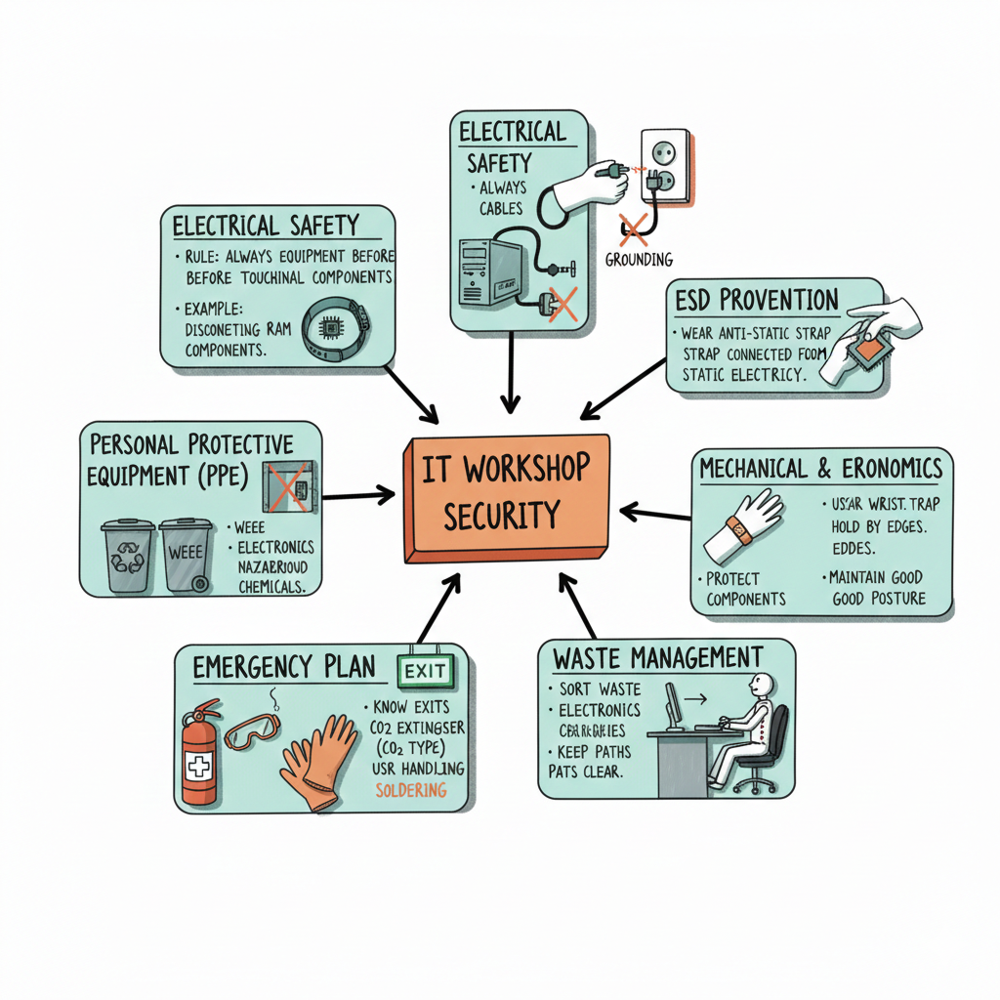

# Workshop Safety

The job of a computer technician is not only to put and remove pieces, but also to manage a safe environment. Security measures are not boring rules, but instruments for two main purposes:

1. **Self protection**: We work with electricity and cutting equipment. The priority is to avoid an electric shock or a cut.
2. **Equipment protection**: Electronic components (processors, RAM memories...) are very sensitive. A little spark we don't notice (static electricity) can destroy a piece worth hundreds of euros at a glance.

In this teaching unit, we will learn how to equip electrostatic discharges (ESDs), how to use tools and how to manage electronic waste. Remember, a good technician is not the smartest, but the one who works the safest and best.

***

<figure><figcaption></figcaption></figure>

#### 1. Electrical Safety (Main Risk)

Since IT equipment is connected to the electrical grid, there is a constant risk of electric shock.

* Always Disconnect: Never manipulate the internal components of a computer while it is plugged into a power source.
* Cable Condition: Regularly check that the insulation of all power cables is intact.
* Grounding: Ensure all sockets have a functional ground connection to prevent surges.

#### 2. Electrostatic Discharge (ESD)

The human body accumulates static electricity, which can burn sensitive electronic components (RAM, processors) just by touching them.

* **Anti-static Wrist Strap**: An essential tool in the workshop. It channels body static to the ground.
* **Conductive Surfaces**: The use of anti-static mats or workbenches is highly recommended.
* **Component Handling**: Always hold parts by their edges; never touch metallic contacts or chips directly.

#### 3. Mechanical Risks and Ergonomics

Safety related to work tools and furniture.

* **Proper Tools**: Use the correct size of screwdrivers to avoid damaging screws or causing hand injuries.
* **Sharp Edges**: Be careful with the inside of computer cases (chassis); they often have sharp metal edges.
* **Posture**: Desks and chairs must be at the correct height to prevent back pain and long-term injury.

#### 4. Waste Management (Environmental)

IT materials are highly polluting and require specific disposal.

* **Green Point**: Batteries and electronic components (WEEE - Waste Electrical and Electronic Equipment) must be disposed of in specific containers.
* **Chemical Products**: When using _isopropyl_ alcohol or compressed air, ensure the room is well-ventilated.

#### 5. Emergency Plan in the Workshop

What to do if something goes wrong?

* **Fire Extinguishers**: The workshop must be equipped with CO2 extinguishers (suitable for electrical fires). Never use water.
* **Exits**: Evacuation routes must always be clear of boxes or computers.
* **First Aid**: Keep a first aid kit nearby for minor cuts or scrapes.
* **Evacuation plan**: In the event of an alarm or a serious emergency (fire, gas leak, etc.).
  * Stop Immediately: Cease all work. Do not try to finish a task or save data.
  * Power Off (If Safe): If you are near a main power switch and it is safe, hit the emergency stop button.
  * Leave Tools Behind: Do not stop to collect your personal belongings or expensive hardware.
  * Follow the Instructions of the Teacher: Move calmly to the nearest Emergency Exit, following the green floor markings or wall signs.
  * Assembly Point: Go directly to the designated meeting area outside the building to be counted.
