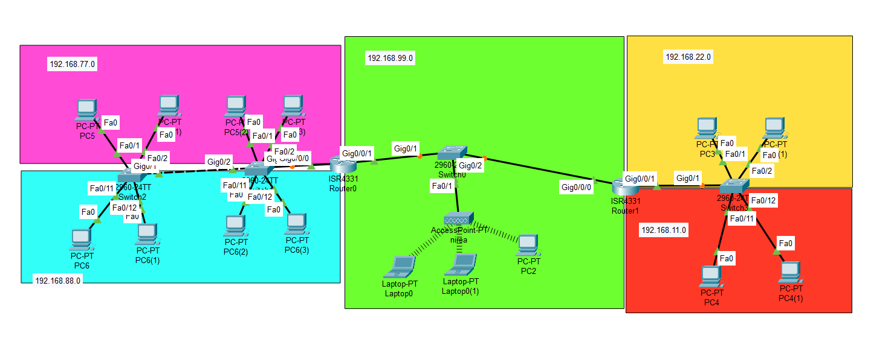
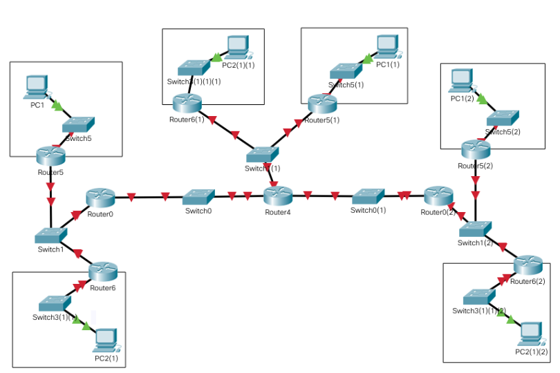

# 5.3 Packet Tracer Exercises

## Virtual LAN

1. What is a VLAN? What is used for?
2. Provided you needed something like as in the picture, how would you configure the interfaces?&#x20;

<figure><figcaption></figcaption></figure>

<table><thead><tr><th valign="top">SWITCH</th><th valign="top">interface</th><th valign="top">Acces/trunk</th><th valign="top">VLAN</th></tr></thead><tbody><tr><td valign="top">Switch0</td><td valign="top">fe1</td><td valign="top"> </td><td valign="top"> </td></tr><tr><td valign="top"></td><td valign="top">fe2</td><td valign="top"> </td><td valign="top"></td></tr><tr><td valign="top"></td><td valign="top">fe10</td><td valign="top"> </td><td valign="top"></td></tr><tr><td valign="top"></td><td valign="top">ge2</td><td valign="top"> </td><td valign="top"></td></tr><tr><td valign="top">Switch1</td><td valign="top">Fe1</td><td valign="top"> </td><td valign="top"> </td></tr><tr><td valign="top"></td><td valign="top">Ge1</td><td valign="top"> </td><td valign="top"></td></tr><tr><td valign="top"></td><td valign="top">Ge2</td><td valign="top"> </td><td valign="top"></td></tr><tr><td valign="top"></td><td valign="top">Fe2</td><td valign="top"> </td><td valign="top"></td></tr><tr><td valign="top">Switch2</td><td valign="top">Ge1</td><td valign="top"> </td><td valign="top"> </td></tr><tr><td valign="top"></td><td valign="top">Fe1</td><td valign="top"> </td><td valign="top"></td></tr><tr><td valign="top"></td><td valign="top">Fe2</td><td valign="top"> </td><td valign="top"></td></tr><tr><td valign="top"></td><td valign="top">Fe3</td><td valign="top"> </td><td valign="top"></td></tr><tr><td valign="top"></td><td valign="top">Fe4</td><td valign="top"> </td><td valign="top"></td></tr></tbody></table>

3. Show the previous network with Packet Tracer.&#x20;
   1.  Use the following network addresses:

       \- Administration: 192.168.10.0/24

       \- Maintenance: 192.168.20.0/24

       \- Marketing: 192.168.30.0/24
   2.  Additional data:

       \- The network is divided in 3 buildings, each having its own switch.

       \- Each building is provided with its DPC.

       \- There are 3 VLANs in total:

       <table data-header-hidden><thead><tr><th valign="top">VLAN ID</th><th valign="top">VLAN izena</th></tr></thead><tbody><tr><td valign="top">10</td><td valign="top">Administration</td></tr><tr><td valign="top">20</td><td valign="top">Maintenance</td></tr><tr><td valign="top">30</td><td valign="top">Marketing</td></tr></tbody></table>

       &#x20;
   3.  Network devices:

       \- Building 1 – Floor 1: 1 device for direction 1 device for technical crew.

       \- 1 eraikina - 2 solairua: ekipo 1 administraritzakoa eta 1 zuzendaritzakoa

       \- 2 eraikina - 1 solairua: ekipo 1 administraritzakoa eta 1 teknikoa

       \- 2 eraikina - 2 solairua: equipo bat teknikoa eta 1 administraritzakoa

       \- 3 eraikina - 1 solairua: ekipo 1 bat zuzendaritzakoa eta 1 teknikoa

       \- 3 eraikina – 2 solairua: ekipo 1 administraritzakoa eta 1 teknikoa
4. **VLAN + ROUTING TABLES (next hop feature) (+ ACL + ROUTER ON-A-STICK)**\
   Do a network as in the picture. Fix the connectivity issues so every network is connected to the others (remember routing tables).

<figure><figcaption></figcaption></figure>

Tip

There are two ways to meet the requirements (one net -orange- shall not have connection):&#x20;

1. Not splitting Router2 righter interface into two (subinterfaces) and only assigning its IP blue net's address.
2. Do the right way and create two subinterfaces so Router2 is in both orange and blue; and then, use ACL features to deny access (both forward and backward) to orange network.


Bear in mind that not configuring a default gateway can make any device disconnected, but that would no be a network configuration so we will not accept it as a solution.


5. **VLAN + ROUNTING TABLES + ROUTER ON-A-STICK CONFIGURATION**\
   Simulate the next network in Cisco Packet Tracer. Provide connectivity among all networks.

<figure><figcaption></figcaption></figure>

6. **VLAN + ROUNTING TABLES + ROUTER ON-A-STICK CONFIGURATION**\
   Simulate the next network in Cisco Packet Tracer. Provide connectivity among all networks.

<figure><figcaption></figcaption></figure>

7. **VLAN + ROUNTING TABLES + ROUTER ON-A-STICK CONFIGURATION**\
   Simulate the next network in Cisco Packet Tracer. Provide connectivity among all networks.

<figure><figcaption></figcaption></figure>

### Wireless Access Point (WAP)

1. Simulate the next network in Cisco Packet Tracer. Provide connectivity among all networks.

<figure><figcaption></figcaption></figure>

Additional exercises

1. **VLAN + ROUTER ON-A-STICK CONFIGURATION**\
   Simulate the next network in Cisco Packet Tracer. Which are the CLI commands needed to configure it out?

<figure><figcaption></figcaption></figure>

2. Cisco Packet Tracer programa erabiliz, simulatu 6 sareren arteko konexioa. Sareen ezaugarriak honako hauek:

| Izena | Sare helbidea   | Ordenagailu kopurua |
| ----- | --------------- | ------------------- |
| S1    | 192.168.16.0/23 | 1                   |
| S2    | 192.168.18.0/23 | 1                   |
| S3    | 192.168.20.0/23 | 1                   |
| S4    | 192.168.22.0/23 | 1                   |
| S5    | 192.168.24.0/22 | 1                   |
| S6    | 192.168.28.0/22 | 1                   |

Sareko eskema ondokoa izan behar:

<figure><figcaption></figcaption></figure>

3. Cisco Packet Tracer programa erabiliz, simulatu 3 sareren arteko konexioa. Sareen ezaugarriak honako hauek:

| Izena                | Sare helbidea   | Ordenagailu kopurua |
| -------------------- | --------------- | ------------------- |
| Ikasleak sarea       | 192.168.21.0/24 | 2                   |
| Irakasleak sarea     | 192.168.22.0/24 | 2                   |
| Aministraritza sarea | 192.168.23.0/24 | 2                   |

Sareko eskema ondokoa izan behar:

<figure><figcaption></figcaption></figure>

4. Cisco Packet tracer programa erabiliz, simulatu ondoko enpresaren sarea:

\- 3 eraikinetan dago banatuta, bakoitza bere switcharekin.\
\- Eraikin bakoitzak 2 solairu ditu, bakoitzat bere switcharekin. Pisu bakoitzeko switcha zuzenean lotzen da eraikineko switch nagusiarekin\
\- Sare guztian zehar 3 VLAN:

| VLAN ID | VLAN Izena      |
| ------- | --------------- |
| 10      | Zuzendaritza    |
| 20      | BulegoTek       |
| 30      | Administraritza |

Sarean ondoko ekipoak jarri behar dira:

* Eraikina 1 - Solairua 1: Zuzendaritza ekipo 1 eta BulegoTek  ekipo 1
* Eraikina 1 - Solairua 2: Administraritzako ekipo 1 eta Zuzendaritzako ekipo 1
* Eraikina 2 - Solairua 1: Administraritzako ekipo 1 eta BulegoTekeko ekipo 1
* Eraikina 2 - Solairua 2: BulegoTek ekipo 1 eta Administraritzako ekipo 1
* Eraikina 3 - Solairua 1: Zuzendaritzako ekipo 1 eta BulegoTekeko ekipo 1
* Eraikina 3 - Solairua 2: BulegoTek ekipo 1 eta Administraritzako ekipo 1

5. Ondoko azpisareak izanda:

* 10.0.0.0/13
* 192.168.192.0/20

Bi sare horientzako egin ondoko hiru lanak:

1. Zatitu azpisare bakoitza tamaina bereko 32 azpisaretan (jarri X.X.X.X/M formatuan lehen hirurak eta azken hirurak)
2. 32 azpisareetatik hirugarrenaren eta azken hirugarren sare  broadcast helbidea eta banatuko diren ip multzoa adierazi.
3. 32 azpisareetatik bigarrena eta azken aurrekoa zatitu 4 azpisaretan

6. Adierazi ondorengo IPak zein klasetakoak diren, publikoak edo pribatuak diren, zein den beraien defektuzko maskara eta ea sare helbidea, broadcast helbidea edo IP arrunt bat diren

| IP                 | klasea      | Publikoa?   | 
Defektuzko

Maskara
 | Sare helbidea, broadcast helbidea edo IP arrunta? |
| ------------------ | ----------- | ----------- | ------------------------------- | ------------------------------------------------- |
| 192.65.26.64/25    | 
 
 | 
 
 | 
 
                     | 
 
                                       |
| 173.65.2.2/18      | 
 
 | 
 
 | 
 
                     | 
 
                                       |
| 25.45.0.0          | 
 
 | 
 
 | 
 
                     | 
 
                                       |
| 10.0.0.255         | 
 
 | 
 
 | 
 
                     | 
 
                                       |
| 192.169.128.128/25 | 
 
 | 
 
 | 
 
                     | 
 
                                       |
| 7.5.0.0/8          | 
 
 | 
 
 | 
 
                     | 
 
                                       |
| 8.8.8.8            | 
 
 | 
 
 | 
 
                     | 
 
                                       |

